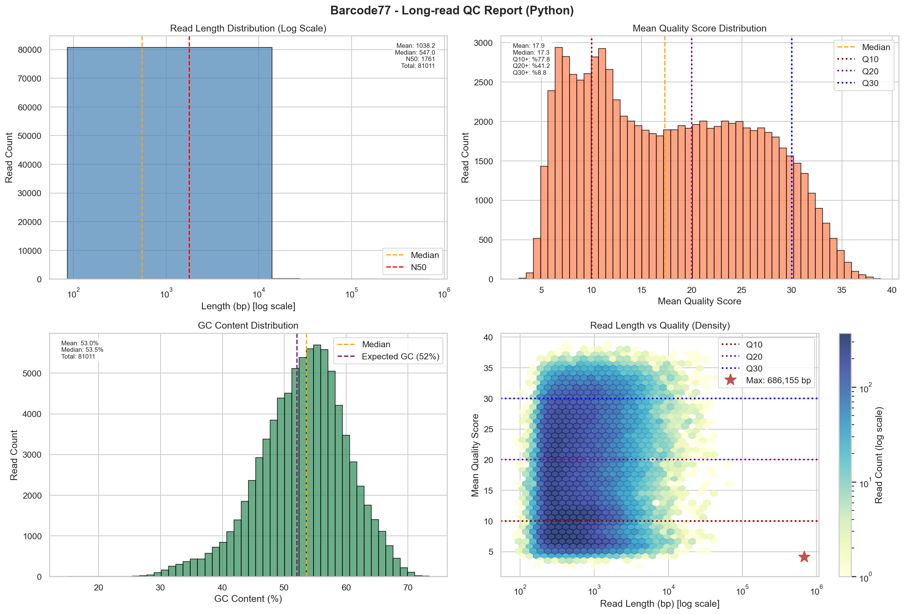
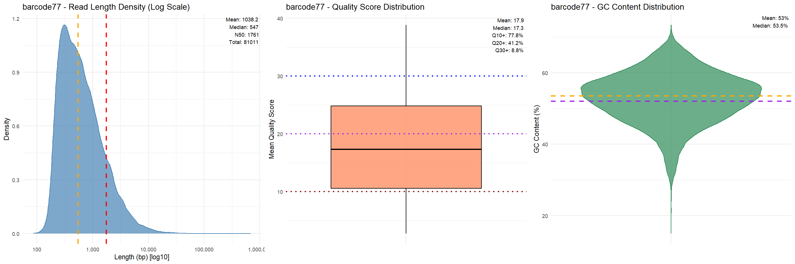
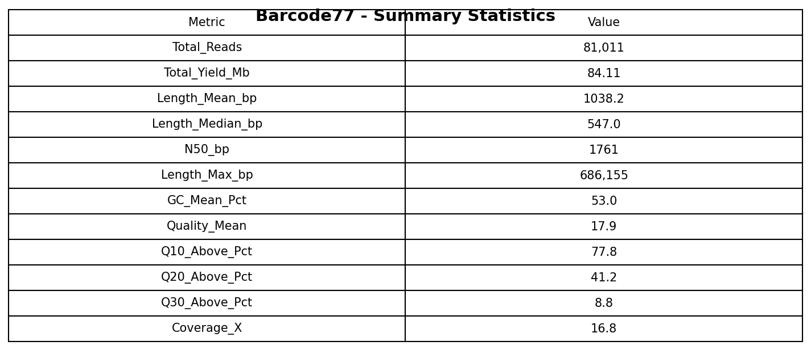

# Mini Bioinformatics Pipeline for Long-Read QC


---

# Overview

This project implements a **reproducible bioinformatics pipeline** for quality control (QC) of **Oxford Nanopore long-read sequencing data** (barcode77 sample).

The pipeline takes a **FASTQ file** as input and performs:

- Long-read specific QC using **NanoQC**
- Read-level statistics (GC content, read length, mean quality)
- Summary statistics with **Q10 / Q20 / Q30 thresholds** and coverage estimation
- Visualizations using **Python (Matplotlib / Seaborn)** and **R (ggplot2)**
- Excel reports and graphical summaries

The workflow is managed by **Snakemake** and runs in a **Conda environment** to ensure reproducibility.

---

# Pipeline Workflow

```
FASTQ
  │
  ▼
NanoQC
  │
  ▼
Read Statistics (Python)
  │
  ▼
Visualizations
   ├── Python (Matplotlib / Seaborn)
   └── R (ggplot2)
  │
  ▼
Reports
   ├── Excel report
   ├── Summary tables
   └── QC plots
```

---

# Key Features

✅ Multi-Sample Support — Process one or multiple FASTQ files with a single command  

✅ Automatic Sample Detection — Place files in `data/` folder and the pipeline detects them automatically  

✅ Sample-Specific Outputs — Each sample gets its own folder (`results/barcode77/`)  

✅ Ultra-Long Read Ready — Handles reads up to **686,155 bp**  

✅ Quality Thresholds — Q10, Q20, Q30 statistics for quality assessment  

✅ Coverage Estimation — Automatic coverage calculation (~16.8X for a 5 Mb genome)  

✅ Dual Visualization — Python (Matplotlib / Seaborn) + R (ggplot2)  

✅ Professional Reports — Excel report, summary tables, NanoQC HTML  

✅ Fully Reproducible — Conda environment + Snakemake workflow  

---

# Results: barcode77 Sample

## Summary Statistics

| Metric | Mean | Median | Min | Max | Std Dev |
|--------|------|--------|-----|-----|---------|
| Read Length (bp) | 1,038 | 547 | 86 | 686,155 | 4,128 |
| GC Content (%) | 53.0 | 52.9 | 24.8 | 74.6 | 4.7 |
| Quality Score | 17.9 | 18.4 | 4.1 | 30.2 | 4.0 |

**Total Reads:** 81,011  
**Total Yield:** 84.11 Mb  
**N50:** 1,761 bp  
**Coverage:** ~17X (for a 5 Mb bacterial genome)

---

## Quality Thresholds

| Threshold | Reads | Percentage |
|-----------|-------|------------|
| Q10+ | 62,987 | 77.8% |
| Q20+ | 33,394 | 41.2% |
| Q30+ | 7,154 | 8.8% |

---

# Graphical Interpretation

## Python QC Plots 

!

| Plot | Description | Interpretation |
|------|-------------|----------------|
| Read Length Distribution | Histogram with log scale | Right-skewed distribution with long-read tail |
| Quality Score Distribution | Histogram with Q10/Q20/Q30 thresholds | Most reads cluster around Q18 |
| GC Content Distribution | Histogram with expected GC line | Centered around expected bacterial GC |
| Length vs Quality | Hexbin density plot | Majority of reads between Q15–30 |

---

## R QC Plots 



| Plot | Description | Interpretation |
|------|-------------|----------------|
| Read Length Distribution | Density plot with log scale | Typical Nanopore distribution |
| Quality Score Distribution | Boxplot with thresholds | Median around Q18 |
| GC Content Distribution | Violin plot | Narrow distribution around 53% |

---

## Summary Table



---

# Key Findings

- An ultra-long read of **686,155 bp** was detected, which may help span repetitive genomic regions during genome assembly.
- The dataset produced **84.11 Mb** of sequencing data, corresponding to approximately **17X coverage** for a 5 Mb bacterial genome.
- **77.8% of reads are above Q10**, indicating most reads are suitable for downstream analysis.
- The **GC content (~53%)** matches the expected range for many bacterial genomes.

---

# Project Structure

```
barcode77-pipeline/
│
├── Snakefile
├── environment.yml
├── README.md
│
├── data/
│   └── barcode77.fastq
│
├── scripts/
│   ├── analyze_reads.py
│   ├── visualize.py
│   └── visualize.R
│
└── results/
    └── barcode77/
        ├── nanoqc_report/
        │   └── barcode77_nanoQC.html
        ├── barcode77_read_stats.csv
        ├── barcode77_summary_stats.csv
        ├── barcode77_report.xlsx
        ├── barcode77_summary_table.png
        ├── barcode77_qc_plots_python.png
        └── barcode77_qc_plots_R.png
```

---

# Installation

Open **Anaconda Prompt** 

Navigate to the project folder:

```bash
cd C:\barcode77-pipeline
```

Create the Conda environment:

```bash
conda env create -f environment.yml
```

Activate the environment:

```bash
conda activate bioinfo-pipeline
```

---

# Running the Pipeline

Preview the workflow:

```bash
snakemake -n
```

Run the pipeline:

```bash
snakemake --cores 4 --latency-wait 30
```

---

# Sample Selection

| Scenario | Command |
|----------|---------|
| Single sample (auto) | `snakemake --cores 4` |
| Specific sample | `snakemake --cores 4 --config sample=barcode77` |
| Multiple samples | `snakemake --cores 4 --config samples='["barcode77","barcode78"]'` |
| All samples | `snakemake --cores 4 --config samples='["all"]'` |

---

# Output Files

| File | Description | Format |
|------|-------------|--------|
| barcode77_nanoQC.html | Interactive NanoQC report | HTML |
| barcode77_read_stats.csv | Read-level statistics | CSV |
| barcode77_summary_stats.csv | Summary metrics | CSV |
| barcode77_report.xlsx | Excel report (2 sheets) | Excel |
| barcode77_summary_table.png | Statistics summary image | PNG |
| barcode77_qc_plots_python.png | Python visualizations | PNG |
| barcode77_qc_plots_R.png | R visualizations | PNG |

---

# Key Terms

**N50** — 50% of total bases are contained in reads longer than this value.  
**Q10** — 90% base-calling accuracy.  
**Q20** — 99% accuracy.  
**Q30** — 99.9% accuracy.  
**Coverage** — Average sequencing depth across the genome.  

---

# Methods

- **NanoQC** — Long-read specific quality control  
- **Biopython / Pandas** — Read-level statistics  
- **Matplotlib / Seaborn** — Data visualization  
- **ggplot2** — Additional graphical summaries  
- **Snakemake** — Workflow automation  
- **Conda** — Reproducible environment management  

---

# Recommendation

Based on the QC metrics, the barcode77 dataset appears suitable for downstream genomic analyses such as **reference-based alignment or genome assembly**.

The ultra-long read (~686 kb) may help improve assembly continuity by spanning large genomic regions.

Common long-read tools such as **minimap2** (alignment) or **Flye** (assembly) could be used for further analysis.

---

# Author

**Ceylin Topkaya**  
